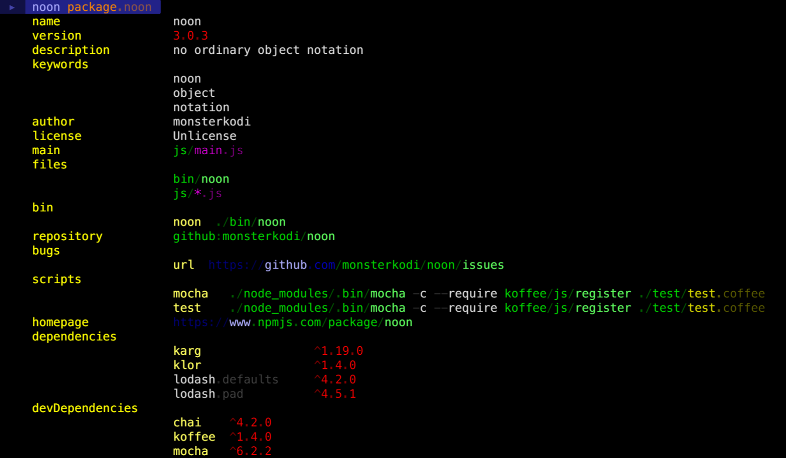
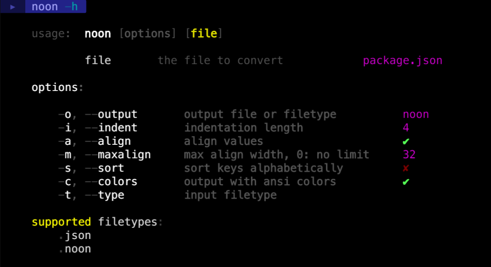

### tl;dr

- you like [CoffeeScript](http://coffeescript.org/)?
    - go ahead, this makes your data smell as good as coffee :)
- you are more into [TypesSript](http://www.typescriptlang.org)? Nothing wrong with [JSON](http://json.org/) or JavaScript?
    - probably nothing interesting to see for you here :(

### format

#### hierarchy 

is expressed by indentation with spaces

```
grandpa
    parent
        child
        sibling
    uncle
```

two or more spaces mark the end of a dictionary key, therefore ...  
keys and list items can have single spaces in them but ...  
only dictionary values can contain consecutive spaces:

```
key 1    value 1
key 2    value 2 contains    spaces
```   
  
#### escaping

if trimming your strings is not an option, you can escape:

```
a             |  leading spaces
b             trailing spaces  |
c             |  leading and trailing spaces  |
pipe symbol   |||
empty string  ||
```     

keys must be escaped from both ends:

```
| s  pace |  key keeps spaces
|    |       key consists of spaces
||           key is empty string
```   
  
#### multiline strings

```
key  ...
value is
a text with
line breaks
which stops
now
...  
```

#### comments
```coffee-script
# comments start with the hash sign
# mixing of data and comments is not allowed
therefore:
    1 # this is not a comment
    | # neither is this one
      # but this one is 
```

#### one key makes an object

```
this is
an   object
```

the above as json: `{"this is": null, "an": "object"}`  
while 

```
this is
not an object
``` 

is equivalent to `["this is", "not an object"]`

#### objects inside lists 

are expressed like this:
```
.
    a  1
.
    b  2
```
the above as json: `[{"a": 1}, {"b": 2}]`

#### dense notation

```
key  . a .. b . c
```

is equivalent to

```
key
    a
        b
    c
```

#### one line notation

**::** represents a line break  
no spaces in keys allowed, therefore ...  
no two-space-seperation necessary:

```
key . a :: b . c :: d 1 :: e 2
```

is equivalent to

```
key
    a
b
    c
d   1
e   2
```

### advantages

- minimal amount of 'control-' or 'non-data-characters', therefore
    - easy to read
    - easy to write
- normally no need to escape characters
    - works well in config files
    - works well in [command line arguments](https://github.com/monsterkodi/colorcat/blob/master/test/test.sh)
    - good for storing [regexp patterns](https://github.com/monsterkodi/colorcat/blob/master/syntax/noon.noon)

### example files

* [language](https://github.com/monsterkodi/language-noon/blob/master/grammars/noon.noon)
* [urtil](https://github.com/monsterkodi/urtil/blob/gh-pages/examples/example)
* [font](https://github.com/monsterkodi/salter/blob/master/font.noon)
* [package](https://github.com/monsterkodi/noon/blob/master/package.noon)

### command line



### module

```coffee-script
noon = require 'noon'

# usage is similar to JSON 

noon.stringify { hello: 'world' }

# hello    world

noon.parse """
hello         world
what's up?    ☺
"""

# { hello: 'world', 'what\'s up?': '☺' }

stringify_options =   # stringify's second argument, defaults are: 
    ext:      '.noon' # output format: .noon .json .yaml .cson .plist
    indent:   4       # number of spaces per indent level
    align:    true    # vertically align object values
    maxalign: 32      # maximal number of spaces when aligning
    sort:     false   # sort object keys alphabetically
    circular: false   # check for circular references (expensive!)
    colors:   false   # colorize output with ansi colors
                      # custom dictionary or true for default colors:

defaultColors =
    url:     colors.yellow
    key:     colors.gray
    null:    colors.blue
    true:    colors.blue.bold
    false:   colors.gray.dim
    path:    colors.green
    value:   colors.white
    string:  colors.white.bold
    semver:  colors.red
    number:  colors.magenta
    visited: colors.red

```

```coffee-script
# load data from file 

data = noon.load 'file.noon' 

# or any of the other types in noon.extnames:

data = noon.load 'file.json'
data = noon.load 'file.yaml'
data = noon.load 'file.cson'
data = noon.load 'file.plist'

```

```coffee-script
# write data to file

noon.save 'file.noon', data

# or

noon.save 'file.noon', data, stringify_options
noon.save 'file.json', data  # < write as json
noon.save 'filenoext', data, ext: '.noon'

```

### caveats

#### missing features

- async load and save

#### disadvantages
  
- keys can't start with the pipe symbol: |
- escaped keys can't contain the pipe symbol
- empty objects are not expressible
- probably some other unknown corner cases

Don't use it if you can't live with the limitations mentioned above.  
Don't expect your data to convert flawlessly!
